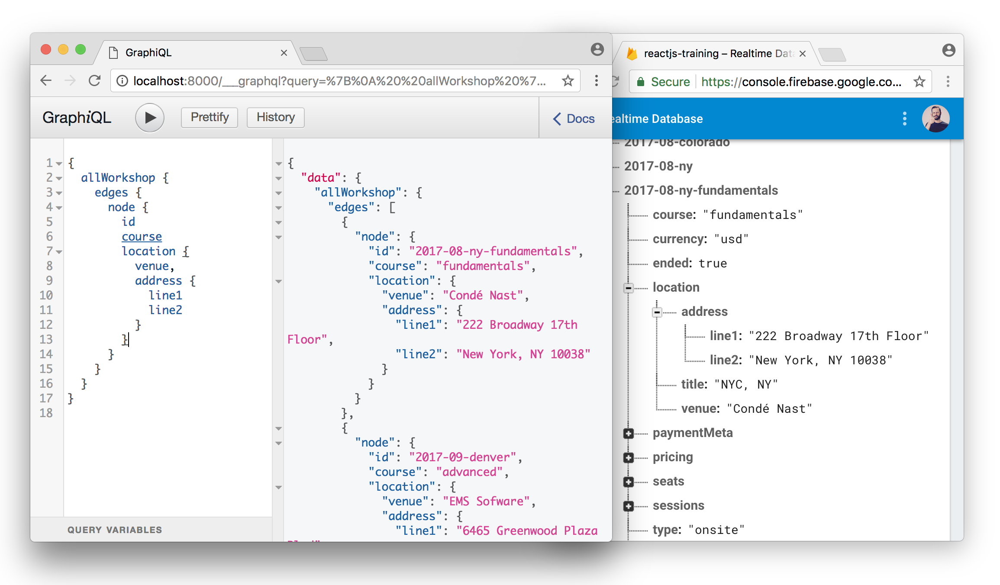

# Gatsby Firebase Source

Quick and dirty firebase source for Gatsby. Allows you to query your firebase data right into your statically generated pages with Gatsby.



## Usage

1. First you need a Private Key from firebase for privileged environments, find out how to get it here: https://firebase.google.com/docs/admin/setup (or click the settings gear > Service accounts tab > Generate New Private Key button at the bottom)

2. Place that private key .json file somewhere in your gatsby project (the root is fine).

3. Configure gatsby-config.js


```js
// the plugin options are:
{
  credential,
  databaseURL,
  types: [{
    type,
    path,
    query,
    map
  }]
}

// Here's an example:

module.exports = {
  // the rest of your config
  plugins: [
    {
      resolve: `gatsby-source-firebase`,
      options: {
        // point to the firebase private key downloaded
        credential: require("./firebase-key.json"),

        // your firebase database root url
        databaseURL: "https://<your-database>.firebaseio.com",

        // you can have multiple "types" that point to different paths
        types: [
          {
            // this type will become `allWorkshop` in graphql
            type: "Workshop",

            // the path to get the records from
            path: "v2/data/workshops",

            // probably don't want your entire database, use the query option
            // to limit however you'd like
            query: ref => ref.limitToLast(10),

            // This allows you to map your data to data that GraphQL likes:
            // 1. Turn your lists into actual arrays
            // 2. Fix keys that GraphQL hates. It doesn't allow number keys
            //    like "0", you'll get this error pretty often:
            //    Error: Names must match /^[_a-zA-Z][_a-zA-Z0-9]*$/ but "0" does not
            // 3. Remove stuff you don't need.
            //
            // Feel free to mutate, we sent you a copy anyway.
            map: node => {
              // fix keys graphql hates
              node.nineteenEightyFive = node['1985']
              delete node['1985']

              // convert a child list to an array:
              return node.sessions = Object.keys(node.sessions).map(key => {
                return { _key: key, session: node.sessions[key] }
              })

              // finally, return the node
              return node
            },
          },

          // if your data is really simple, this should be fine too
          {
            type: "CourseDescriptions",
            path: "text/courseDescriptions",
          }
        ]
      }
    }
  ]
}
```

Enjoy!
